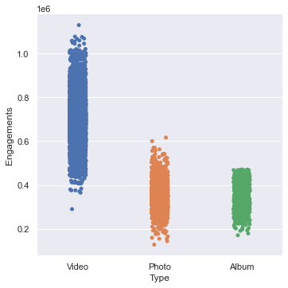
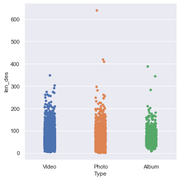
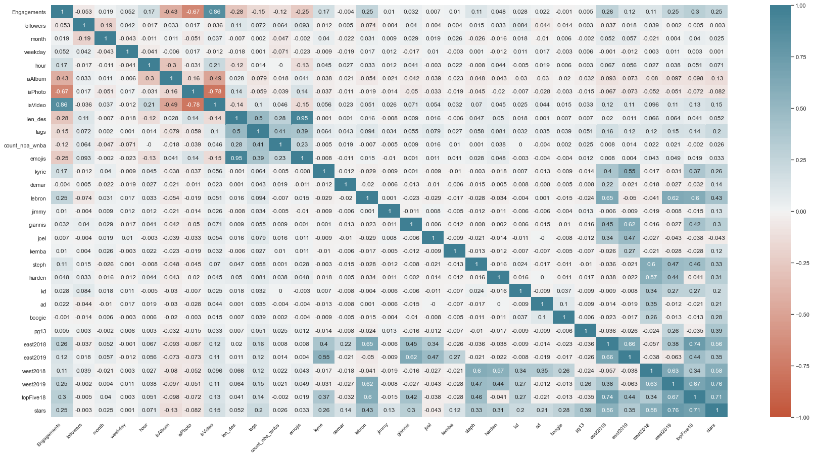

# Final Project
### Rishi Gummakonda - BIS 397, Spring 2021

## Introduction:
<p>Basketball is my favorite sport. At its core, its a game for kids. But to me, and so many people, its a lot more. Everything about it is capitvating: the offense, the defense, the personalities, the culture, and especially the passion. I could go on and on. Even though I was never blessed with the physical gifts or work ethic to take my playing skills anywhere besides the driveway or the local park, it would still be a dream to go to the NBA. </p>

A couple of years ago I found the website for the [2019 NBA Hackathon](https://hackathon.nba.com). The hackathon has two prompts, one for basketball analytics, another for business. This project will be based on the business prompt from the 2019 NBA Hackathon. 

The business prompt and dataset were originally on the hackathon's webpage but have since been removed. Even though I never ended up enrolling in the competition, I downloaded all the prompts and datasets. The original business prompt can be found on the following link:  (https://drive.google.com/file/d/1sXCpQhgL0pvTSDY_grhz1EN7ItBLPB0a/view?usp=sharing).

The NBA complied in a training dataset of 7,766 (real) Instagram posts by @nba starting from 10/01/2017 (1,595 individual photos, 713 photo albums, and 5,458 videos). 

The training set can be found on the following link:(https://drive.google.com/file/d/1nljN5HI6Sb7YTegEUF0CSzl3bPLg7wR3/view?usp=sharing).


```python
#Import pandas to read in dataset
import pandas as pd

#for basic numerical functions 
import numpy as np

```


```python
#Read in training set 
training = pd.read_csv('/Users/rishigummakonda/Desktop/BIS 397/final/training_set.csv',encoding='mac_roman')

#Renaming Followers at Posting to followers for clairity:
training = training.rename(columns={"Followers at Posting": "followers"})
```

Here I am previewing the dataset to see what kind of features are in the dataset:


```python
training.head()
```


<div>
<style scoped>
    .dataframe tbody tr th:only-of-type {
        vertical-align: middle;
    }

    .dataframe tbody tr th {
        vertical-align: top;
    }

    .dataframe thead th {
        text-align: right;
    }
</style>
<table border="1" class="dataframe">
  <thead>
    <tr style="text-align: right;">
      <th></th>
      <th>Engagements</th>
      <th>followers</th>
      <th>Created</th>
      <th>Type</th>
      <th>Description</th>
    </tr>
  </thead>
  <tbody>
    <tr>
      <th>0</th>
      <td>502093</td>
      <td>36984682</td>
      <td>2019-05-21 23:30:51 EDT</td>
      <td>Video</td>
      <td>The @raptors bench trio of @sergeibaka @norman...</td>
    </tr>
    <tr>
      <th>1</th>
      <td>603380</td>
      <td>36984682</td>
      <td>2019-05-21 22:53:33 EDT</td>
      <td>Video</td>
      <td>@kyle_lowry7 pulls from deep for the @raptors ...</td>
    </tr>
    <tr>
      <th>2</th>
      <td>603380</td>
      <td>36984682</td>
      <td>2019-05-21 22:19:58 EDT</td>
      <td>Video</td>
      <td>@k_mid22 with some english on the @bucks dime!</td>
    </tr>
    <tr>
      <th>3</th>
      <td>725100</td>
      <td>36984682</td>
      <td>2019-05-21 22:02:41 EDT</td>
      <td>Video</td>
      <td>Kawhi punches it home with the left on TNT!</td>
    </tr>
    <tr>
      <th>4</th>
      <td>661446</td>
      <td>36984682</td>
      <td>2019-05-21 20:47:49 EDT</td>
      <td>Video</td>
      <td>@giannis_an34 goes baseline early to rock the ...</td>
    </tr>
  </tbody>
</table>
</div>


<ol>
<li>Engagements: Instagram "engagement" numbers are the sum of likes, comments, and saves on a certain post. According to the NBA, the engagement numbers are not real, they are artficially generated.There’s no (intentional) correlation with the real-life engagement totals belonging to posts by @nba.</li>
<li>followers: number of followers at the time of posting</li>
<li>Created: Datetime stamp of post (Eastern time)</li>
<li>Type: Classification of post as Individual Photo, Photo Album, or Video</li>
<li>Description: @nba‘s post caption / description of the post / commentary on the event displayed in the post.</li>
</ol>

<p> The data provided can provide many insights regarding what makes NBA instagram posts popular or unpopular. Using AI to determine the factors that drive engagement allows the NBA to be more efficent with their marketing. With the insights, they can tailor their strategy to make mosts more engaging, and ultimately boost the NBA brand.  Instagram is especially great for advertisting a product. AI can play a powerful role in marketing, and the NBA should utilize it to its benefit.</p>

<p> There are many factors that may drive a post engagement that are not included within the dataset. There may be specific events or time periods that may drive or stifle engagement, or determine the kind of posts the NBA chooses to display. For example, when Kobe Bryant suddenly died over a year ago, the NBA's instagram centered around his legacy. This defintely effected engagement numbers abnormally. This would be a greater issue if the engagement numbers given by the NBA were not artificially generated. However, because engagements are artifically generated, it can be assumed that any other factors that may drive engagement are not relevant.</p>

## Detailed Description:

<p> The numerical variables are Engagments, and Followers at Posting. Categorical variables are Created, Type, and Description. To analyze Created, the data needs to be transformed from a DateTime object into smaller categories. For example, it may be able to be broken down into the numerical following: day of the week (1 to 7), hour and month. To analyze Type, the data can be transformed from the three types to numerical representations (1, 2, 3). Description can be analyzed through sentiment analysis. Other numerical data can be gathered from the descriptions such as length, types of characters used, and if the account is tagged.


```python
training['Created'] = pd.to_datetime(training['Created'])
training['month'] = training.Created.dt.month
training['weekday'] = training.Created.dt.weekday
training['hour'] = training.Created.dt.hour
training.dtypes
```


    Engagements                        int64
    followers                          int64
    Created        datetime64[ns, tzlocal()]
    Type                              object
    Description                       object
    month                              int64
    weekday                            int64
    hour                               int64
    dtype: object


```python
dummies= pd.get_dummies(training.drop(['Description'],axis=1))
training['isAlbum']= dummies['Type_Album']
training['isPhoto']= dummies['Type_Photo']
training['isVideo']= dummies['Type_Video']
```


```python
#length of description
training['len_des'] = training['Description'].str.len()
```


```python
training['tags'] = training['Description'].str.count("@")
training.tags.value_counts().head()*100/7766
```


    2.0    35.745558
    1.0    30.775174
    0.0    19.456606
    3.0     8.910636
    4.0     3.322174
    Name: tags, dtype: float64


```python
training['count_nba_wnba'] = training['Description'].str.count('@nba') + training['Description'].str.count('@wnba')
training.count_nba_wnba.value_counts()*100/7766
```


    0.0    85.642544
    1.0    13.868143
    2.0     0.296163
    3.0     0.012877
    Name: count_nba_wnba, dtype: float64


```python
training['emojis'] = training['Description'].str.count('\ ?? ')
training.emojis.value_counts().head()*100/7766
```


    6.0    9.541592
    7.0    8.511460
    8.0    8.112284
    5.0    8.086531
    9.0    7.584342
    Name: emojis, dtype: float64


```python
training['kyrie'] = training['Description'].str.count('@kyrieirving')
training['demar'] =training['Description'].str.count('@demar_derozan')
training['lebron'] = training['Description'].str.count('@kingjames')
training['jimmy'] = training['Description'].str.count('@jimmybutler')
training['giannis'] = training['Description'].str.count('@giannis_an34')
training['joel'] = training['Description'].str.count('@joelembiid')
training['kemba'] = training['Description'].str.count('@_kw15')
training['steph'] = training['Description'].str.count('@stephencurry30')
training['harden'] =training['Description'].str.count('@jharden13')
training['kd'] = training['Description'].str.count('@easymoneysniper')
#training['kawhi'] = training['Description'].str.count('kawhi')
training['ad'] = training['Description'].str.count('@antdavis23')
training['boogie'] = training['Description'].str.count('@boogiecousins')
training['pg13'] = training['Description'].str.count('@ygtrece')
```


```python
training['east2018'] = training['kyrie'] + training['demar'] + training['lebron'] + training['joel'] + training['giannis']
training.east2018.value_counts()*100/7766
```


    0.0    88.037600
    1.0    11.601854
    2.0     0.180273
    Name: east2018, dtype: float64


```python
training['east2019'] = training['kyrie'] + training['kemba'] + training['joel'] + training['giannis']
training.east2019.value_counts()*100/7766
```


    0.0    93.497296
    1.0     6.219418
    2.0     0.103013
    Name: east2019, dtype: float64


```python
training['west2018'] = training['steph'] + training['harden'] + training['kd']  + training['ad'] + training['boogie']
training.west2018.value_counts()*100/7766
```


    0.0    92.093742
    1.0     7.507082
    2.0     0.218903
    Name: west2018, dtype: float64


```python
training['west2019'] = training['steph'] + training['harden'] + training['kd']  + training['lebron'] + training['pg13']
training.west2019.value_counts()*100/7766
```


    0.0    87.071852
    1.0    12.503219
    2.0     0.244656
    Name: west2019, dtype: float64


```python
training['topFive18'] = training['steph'] + training['lebron'] + training['kd']  + training['giannis'] + training['kyrie']#+ training['joel']
training.topFive18.value_counts()*100/7766
```


    0.0    86.595416
    1.0    12.812259
    2.0     0.399176
    3.0     0.012877
    Name: topFive18, dtype: float64


```python
training['stars'] = training['topFive18'] +  + training['ad'] + training['boogie']+ training['pg13'] + training['harden'] + training['demar']+training['kemba']+training['jimmy']+training['pg13']+training['boogie']
training.stars.value_counts()*100/7766
```


    0.0    80.208602
    1.0    17.602369
    2.0     1.854236
    3.0     0.154520
    Name: stars, dtype: float64


```python
training.sort_values("Engagements", ascending = False)
```


<div>
<style scoped>
    .dataframe tbody tr th:only-of-type {
        vertical-align: middle;
    }

    .dataframe tbody tr th {
        vertical-align: top;
    }

    .dataframe thead th {
        text-align: right;
    }
</style>
<table border="1" class="dataframe">
  <thead>
    <tr style="text-align: right;">
      <th></th>
      <th>Engagements</th>
      <th>followers</th>
      <th>Created</th>
      <th>Type</th>
      <th>Description</th>
      <th>month</th>
      <th>weekday</th>
      <th>hour</th>
      <th>isAlbum</th>
      <th>isPhoto</th>
      <th>...</th>
      <th>kd</th>
      <th>ad</th>
      <th>boogie</th>
      <th>pg13</th>
      <th>east2018</th>
      <th>east2019</th>
      <th>west2018</th>
      <th>west2019</th>
      <th>topFive18</th>
      <th>stars</th>
    </tr>
  </thead>
  <tbody>
    <tr>
      <th>5921</th>
      <td>1129585</td>
      <td>26873604</td>
      <td>2018-02-18 19:59:49-05:00</td>
      <td>Video</td>
      <td>The captains meet for pregame #NBAAllStar talk...</td>
      <td>2</td>
      <td>6</td>
      <td>19</td>
      <td>0</td>
      <td>0</td>
      <td>...</td>
      <td>0.0</td>
      <td>0.0</td>
      <td>0.0</td>
      <td>0.0</td>
      <td>1.0</td>
      <td>0.0</td>
      <td>1.0</td>
      <td>2.0</td>
      <td>2.0</td>
      <td>2.0</td>
    </tr>
    <tr>
      <th>3699</th>
      <td>1077014</td>
      <td>30719053</td>
      <td>2018-09-16 12:06:15-04:00</td>
      <td>Video</td>
      <td>30 days from #KiaTipOff18... we flashback to @...</td>
      <td>9</td>
      <td>6</td>
      <td>12</td>
      <td>0</td>
      <td>0</td>
      <td>...</td>
      <td>0.0</td>
      <td>0.0</td>
      <td>0.0</td>
      <td>0.0</td>
      <td>0.0</td>
      <td>0.0</td>
      <td>0.0</td>
      <td>0.0</td>
      <td>0.0</td>
      <td>0.0</td>
    </tr>
    <tr>
      <th>3876</th>
      <td>1075434</td>
      <td>30047470</td>
      <td>2018-08-11 20:55:20-04:00</td>
      <td>Video</td>
      <td>At #1 on the TOP 60 DIMES... @kingjames! #NBAA...</td>
      <td>8</td>
      <td>5</td>
      <td>20</td>
      <td>0</td>
      <td>0</td>
      <td>...</td>
      <td>0.0</td>
      <td>0.0</td>
      <td>0.0</td>
      <td>0.0</td>
      <td>1.0</td>
      <td>0.0</td>
      <td>0.0</td>
      <td>1.0</td>
      <td>1.0</td>
      <td>1.0</td>
    </tr>
    <tr>
      <th>5901</th>
      <td>1067990</td>
      <td>26873604</td>
      <td>2018-02-18 23:32:14-05:00</td>
      <td>Video</td>
      <td>@kingjames (29p/10r/8a) hoists the 2018 #NBAAl...</td>
      <td>2</td>
      <td>6</td>
      <td>23</td>
      <td>0</td>
      <td>0</td>
      <td>...</td>
      <td>0.0</td>
      <td>0.0</td>
      <td>0.0</td>
      <td>0.0</td>
      <td>1.0</td>
      <td>0.0</td>
      <td>0.0</td>
      <td>1.0</td>
      <td>1.0</td>
      <td>1.0</td>
    </tr>
    <tr>
      <th>3762</th>
      <td>1066099</td>
      <td>30442523</td>
      <td>2018-09-01 12:18:40-04:00</td>
      <td>Video</td>
      <td>Coming in at No.5...@kyrieirving SOMEHOW finds...</td>
      <td>9</td>
      <td>5</td>
      <td>12</td>
      <td>0</td>
      <td>0</td>
      <td>...</td>
      <td>0.0</td>
      <td>0.0</td>
      <td>0.0</td>
      <td>0.0</td>
      <td>1.0</td>
      <td>1.0</td>
      <td>0.0</td>
      <td>0.0</td>
      <td>1.0</td>
      <td>1.0</td>
    </tr>
    <tr>
      <th>...</th>
      <td>...</td>
      <td>...</td>
      <td>...</td>
      <td>...</td>
      <td>...</td>
      <td>...</td>
      <td>...</td>
      <td>...</td>
      <td>...</td>
      <td>...</td>
      <td>...</td>
      <td>...</td>
      <td>...</td>
      <td>...</td>
      <td>...</td>
      <td>...</td>
      <td>...</td>
      <td>...</td>
      <td>...</td>
      <td>...</td>
      <td>...</td>
    </tr>
    <tr>
      <th>3613</th>
      <td>159402</td>
      <td>31026589</td>
      <td>2018-09-30 16:48:19-04:00</td>
      <td>Photo</td>
      <td>?? 3rd straight @FIBA World Cup Gold Medal ??\...</td>
      <td>9</td>
      <td>6</td>
      <td>16</td>
      <td>0</td>
      <td>1</td>
      <td>...</td>
      <td>0.0</td>
      <td>0.0</td>
      <td>0.0</td>
      <td>0.0</td>
      <td>0.0</td>
      <td>0.0</td>
      <td>0.0</td>
      <td>0.0</td>
      <td>0.0</td>
      <td>0.0</td>
    </tr>
    <tr>
      <th>3934</th>
      <td>154757</td>
      <td>29876355</td>
      <td>2018-08-04 00:33:09-04:00</td>
      <td>Photo</td>
      <td>Representing #TeamWORLD in the 2018 #NBAAfrica...</td>
      <td>8</td>
      <td>5</td>
      <td>0</td>
      <td>0</td>
      <td>1</td>
      <td>...</td>
      <td>0.0</td>
      <td>0.0</td>
      <td>0.0</td>
      <td>0.0</td>
      <td>0.0</td>
      <td>0.0</td>
      <td>0.0</td>
      <td>0.0</td>
      <td>0.0</td>
      <td>0.0</td>
    </tr>
    <tr>
      <th>3713</th>
      <td>154556</td>
      <td>30586755</td>
      <td>2018-09-09 14:10:31-04:00</td>
      <td>Photo</td>
      <td>Congratulations to the @lvaces' @aja22wilson o...</td>
      <td>9</td>
      <td>6</td>
      <td>14</td>
      <td>0</td>
      <td>1</td>
      <td>...</td>
      <td>0.0</td>
      <td>0.0</td>
      <td>0.0</td>
      <td>0.0</td>
      <td>0.0</td>
      <td>0.0</td>
      <td>0.0</td>
      <td>0.0</td>
      <td>0.0</td>
      <td>0.0</td>
    </tr>
    <tr>
      <th>3789</th>
      <td>143702</td>
      <td>30321656</td>
      <td>2018-08-26 10:39:01-04:00</td>
      <td>Photo</td>
      <td>@breannastewart30 of the @seattlestorm named 2...</td>
      <td>8</td>
      <td>6</td>
      <td>10</td>
      <td>0</td>
      <td>1</td>
      <td>...</td>
      <td>0.0</td>
      <td>0.0</td>
      <td>0.0</td>
      <td>0.0</td>
      <td>0.0</td>
      <td>0.0</td>
      <td>0.0</td>
      <td>0.0</td>
      <td>0.0</td>
      <td>0.0</td>
    </tr>
    <tr>
      <th>3933</th>
      <td>127816</td>
      <td>29876355</td>
      <td>2018-08-04 00:37:27-04:00</td>
      <td>Photo</td>
      <td>Representing #TeamWORLD in the 2018 #NBAAfrica...</td>
      <td>8</td>
      <td>5</td>
      <td>0</td>
      <td>0</td>
      <td>1</td>
      <td>...</td>
      <td>0.0</td>
      <td>0.0</td>
      <td>0.0</td>
      <td>0.0</td>
      <td>1.0</td>
      <td>1.0</td>
      <td>0.0</td>
      <td>0.0</td>
      <td>0.0</td>
      <td>0.0</td>
    </tr>
  </tbody>
</table>
<p>7766 rows × 34 columns</p>
</div>


```python
training.Type.value_counts()
```


    Video    5458
    Photo    1595
    Album     713
    Name: Type, dtype: int64


```python
print("Percentage of Total Dataset:")
print((training.Type.value_counts()*100/7766).round(2))
```

    Percentage of Total Dataset:
    Video    70.28
    Photo    20.54
    Album     9.18
    Name: Type, dtype: float64


```python
print("Average Video Followers at Posting:",np.mean(training[training['Type']=='Video']['followers']))
print("Average Photo Followers at Posting:",np.mean(training[training['Type']=='Photo']['followers']))
print("Average Album Followers at Posting:",np.mean(training[training['Type']=='Album']['followers']))
```

    Average Video Followers at Posting: 30340952.7425797
    Average Photo Followers at Posting: 30551143.04952978
    Average Album Followers at Posting: 30815575.74053296


```python
print("Average Video Length of Description:",np.mean(training[training['Type']=='Video']['len_des']))
print("Average Photo Length of Description:",np.mean(training[training['Type']=='Photo']['len_des']))
print("Average Album Length of Description:",np.mean(training[training['Type']=='Album']['len_des']))
```

    Average Video Length of Description: 65.7011557512383
    Average Photo Length of Description: 79.63413098236776
    Average Album Length of Description: 72.47826086956522


```python
print("Average Video Engagements:",np.mean(training[training['Type']=='Video']['Engagements']))
print("Average Photo Engagements:",np.mean(training[training['Type']=='Photo']['Engagements']))
print("Average Album Engagements:",np.mean(training[training['Type']=='Album']['Engagements']))
```

    Average Video Engagements: 692773.5756687431
    Average Photo Engagements: 357547.36363636365
    Average Album Engagements: 348465.3394109397


```python
training.describe()
```


<div>
<style scoped>
    .dataframe tbody tr th:only-of-type {
        vertical-align: middle;
    }

    .dataframe tbody tr th {
        vertical-align: top;
    }

    .dataframe thead th {
        text-align: right;
    }
</style>
<table border="1" class="dataframe">
  <thead>
    <tr style="text-align: right;">
      <th></th>
      <th>Engagements</th>
      <th>followers</th>
      <th>month</th>
      <th>weekday</th>
      <th>hour</th>
      <th>isAlbum</th>
      <th>isPhoto</th>
      <th>isVideo</th>
      <th>len_des</th>
      <th>tags</th>
      <th>...</th>
      <th>kd</th>
      <th>ad</th>
      <th>boogie</th>
      <th>pg13</th>
      <th>east2018</th>
      <th>east2019</th>
      <th>west2018</th>
      <th>west2019</th>
      <th>topFive18</th>
      <th>stars</th>
    </tr>
  </thead>
  <tbody>
    <tr>
      <th>count</th>
      <td>7.766000e+03</td>
      <td>7.766000e+03</td>
      <td>7766.000000</td>
      <td>7766.000000</td>
      <td>7766.000000</td>
      <td>7766.000000</td>
      <td>7766.000000</td>
      <td>7766.000000</td>
      <td>7752.000000</td>
      <td>7752.000000</td>
      <td>...</td>
      <td>7752.000000</td>
      <td>7752.000000</td>
      <td>7752.000000</td>
      <td>7752.000000</td>
      <td>7752.00000</td>
      <td>7752.000000</td>
      <td>7752.000000</td>
      <td>7752.000000</td>
      <td>7752.000000</td>
      <td>7752.000000</td>
    </tr>
    <tr>
      <th>mean</th>
      <td>5.923129e+05</td>
      <td>3.042770e+07</td>
      <td>5.996652</td>
      <td>3.081767</td>
      <td>15.925444</td>
      <td>0.091810</td>
      <td>0.205382</td>
      <td>0.702807</td>
      <td>69.178664</td>
      <td>1.511739</td>
      <td>...</td>
      <td>0.008772</td>
      <td>0.009030</td>
      <td>0.004128</td>
      <td>0.009804</td>
      <td>0.11984</td>
      <td>0.064370</td>
      <td>0.079592</td>
      <td>0.130160</td>
      <td>0.136739</td>
      <td>0.218137</td>
    </tr>
    <tr>
      <th>std</th>
      <td>1.792682e+05</td>
      <td>3.748957e+06</td>
      <td>3.910491</td>
      <td>1.970062</td>
      <td>7.319283</td>
      <td>0.288777</td>
      <td>0.404007</td>
      <td>0.457052</td>
      <td>37.060662</td>
      <td>1.123340</td>
      <td>...</td>
      <td>0.093253</td>
      <td>0.094602</td>
      <td>0.064121</td>
      <td>0.098535</td>
      <td>0.33031</td>
      <td>0.249598</td>
      <td>0.278664</td>
      <td>0.343709</td>
      <td>0.356132</td>
      <td>0.465855</td>
    </tr>
    <tr>
      <th>min</th>
      <td>1.278160e+05</td>
      <td>2.487554e+07</td>
      <td>1.000000</td>
      <td>0.000000</td>
      <td>0.000000</td>
      <td>0.000000</td>
      <td>0.000000</td>
      <td>0.000000</td>
      <td>2.000000</td>
      <td>0.000000</td>
      <td>...</td>
      <td>0.000000</td>
      <td>0.000000</td>
      <td>0.000000</td>
      <td>0.000000</td>
      <td>0.00000</td>
      <td>0.000000</td>
      <td>0.000000</td>
      <td>0.000000</td>
      <td>0.000000</td>
      <td>0.000000</td>
    </tr>
    <tr>
      <th>25%</th>
      <td>4.173900e+05</td>
      <td>2.698910e+07</td>
      <td>3.000000</td>
      <td>1.000000</td>
      <td>12.000000</td>
      <td>0.000000</td>
      <td>0.000000</td>
      <td>0.000000</td>
      <td>44.000000</td>
      <td>1.000000</td>
      <td>...</td>
      <td>0.000000</td>
      <td>0.000000</td>
      <td>0.000000</td>
      <td>0.000000</td>
      <td>0.00000</td>
      <td>0.000000</td>
      <td>0.000000</td>
      <td>0.000000</td>
      <td>0.000000</td>
      <td>0.000000</td>
    </tr>
    <tr>
      <th>50%</th>
      <td>6.397285e+05</td>
      <td>3.004747e+07</td>
      <td>5.000000</td>
      <td>3.000000</td>
      <td>19.000000</td>
      <td>0.000000</td>
      <td>0.000000</td>
      <td>1.000000</td>
      <td>63.000000</td>
      <td>1.000000</td>
      <td>...</td>
      <td>0.000000</td>
      <td>0.000000</td>
      <td>0.000000</td>
      <td>0.000000</td>
      <td>0.00000</td>
      <td>0.000000</td>
      <td>0.000000</td>
      <td>0.000000</td>
      <td>0.000000</td>
      <td>0.000000</td>
    </tr>
    <tr>
      <th>75%</th>
      <td>7.216282e+05</td>
      <td>3.392854e+07</td>
      <td>10.000000</td>
      <td>5.000000</td>
      <td>21.000000</td>
      <td>0.000000</td>
      <td>0.000000</td>
      <td>1.000000</td>
      <td>88.250000</td>
      <td>2.000000</td>
      <td>...</td>
      <td>0.000000</td>
      <td>0.000000</td>
      <td>0.000000</td>
      <td>0.000000</td>
      <td>0.00000</td>
      <td>0.000000</td>
      <td>0.000000</td>
      <td>0.000000</td>
      <td>0.000000</td>
      <td>0.000000</td>
    </tr>
    <tr>
      <th>max</th>
      <td>1.129585e+06</td>
      <td>3.698468e+07</td>
      <td>12.000000</td>
      <td>6.000000</td>
      <td>23.000000</td>
      <td>1.000000</td>
      <td>1.000000</td>
      <td>1.000000</td>
      <td>639.000000</td>
      <td>10.000000</td>
      <td>...</td>
      <td>1.000000</td>
      <td>1.000000</td>
      <td>1.000000</td>
      <td>1.000000</td>
      <td>2.00000</td>
      <td>2.000000</td>
      <td>2.000000</td>
      <td>2.000000</td>
      <td>3.000000</td>
      <td>3.000000</td>
    </tr>
  </tbody>
</table>
<p>8 rows × 31 columns</p>
</div>


```python
#basic data visualization of Type of posts vs. Engagement
import seaborn as sns
import matplotlib.pyplot as plt
sns.set(rc={'figure.figsize':(11.7,8.27)})
```


```python
sns.catplot(x="Type", y="Engagements", data=training)
```


    <seaborn.axisgrid.FacetGrid at 0x7fd61c4b9a60>


    

    


```python
sns.catplot(x="Type", y="len_des", data=training)
```


    <seaborn.axisgrid.FacetGrid at 0x7fd61d936d30>


    

    


```python
plt.figure(figsize=(30,15))
ax3 = sns.heatmap(training.corr().round(3),vmin=-1, vmax=1, center=0,cmap=sns.diverging_palette(20, 220, n=200), 
                  square=False, annot=True, annot_kws={"size": 12})

ax3.set_xticklabels(ax3.get_xticklabels(), rotation=45, horizontalalignment='right', fontsize=10);

#listing the correlation values
correlation_mat = training.corr()

corr_pairs = correlation_mat.unstack()

#sorting
sorted_pairs = corr_pairs.sort_values(kind="quicksort")

#only looking at pairs that go with total revenue
strong_pairs = sorted_pairs[abs(sorted_pairs) > 0.245][['Engagements']]
strong_pairs_no1 = strong_pairs[abs(sorted_pairs) < 1]
print(strong_pairs_no1)

#only looking at pairs that go with total revenue
strong_pairs2 = sorted_pairs[abs(sorted_pairs) > 0.5]
strong_pairs_no2 = strong_pairs2[abs(sorted_pairs) < 1]
print(strong_pairs_no2)
```

    Engagements  isPhoto     -0.665827
                 isAlbum     -0.432515
                 len_des     -0.276022
                 emojis      -0.246733
                 lebron       0.249850
                 west2019     0.251167
                 stars        0.253411
                 east2018     0.257968
                 topFive18    0.298033
                 isVideo      0.861826
    dtype: float64
    isPhoto      isVideo       -0.781810
    isVideo      isPhoto       -0.781810
    isPhoto      Engagements   -0.665827
    Engagements  isPhoto       -0.665827
    kyrie        east2019       0.550849
    east2019     kyrie          0.550849
    stars        east2018       0.564562
    east2018     stars          0.564562
    west2018     harden         0.574585
    harden       west2018       0.574585
    stars        west2018       0.584778
    west2018     stars          0.584778
    steph        west2018       0.599425
    west2018     steph          0.599425
    topFive18    lebron         0.599671
    lebron       topFive18      0.599671
    east2019     giannis        0.618919
    giannis      east2019       0.618919
    west2019     lebron         0.620931
    lebron       west2019       0.620931
    west2019     west2018       0.631333
    west2018     west2019       0.631333
    lebron       east2018       0.646660
    east2018     lebron         0.646660
                 east2019       0.655997
    east2019     east2018       0.655997
    topFive18    west2019       0.666162
    west2019     topFive18      0.666162
    topFive18    stars          0.715257
    stars        topFive18      0.715257
    topFive18    east2018       0.743568
    east2018     topFive18      0.743568
    west2019     stars          0.757325
    stars        west2019       0.757325
    isVideo      Engagements    0.861826
    Engagements  isVideo        0.861826
    emojis       len_des        0.947188
    len_des      emojis         0.947188
    dtype: float64


    

    


```python
sns.boxplot(x="month", y="Engagements", data=training, hue="Type")
```


    <AxesSubplot:xlabel='month', ylabel='Engagements'>


    

    


```python
sns.boxplot(x="weekday", y="Engagements", data=training, hue="Type")
```


    <AxesSubplot:xlabel='weekday', ylabel='Engagements'>


    

    


```python
sns.boxplot(x="hour", y="Engagements", data=training, hue="Type")
```


    <AxesSubplot:xlabel='hour', ylabel='Engagements'>


    

    


The two graphs above demonstrate that there seems to be higher engagement on every kind of post in between hours of 18:00 to 1:00 relative to all other hours. This does not defintely indicate correlation between time of post and quality of post as those are also the hours where the NBA has the most games live on TV.

This correlation matrix displays that none of the numerical factors have high correlation to Engagement. The highest correlation is the hour it is posted, although it is weak.


```python
sns.scatterplot(x="followers", y="Engagements", hue="Type", data=training)
```


    <AxesSubplot:xlabel='followers', ylabel='Engagements'>


    

    


```python
sns.scatterplot(x="len_des", y="Engagements", hue="Type", data=training)
```


    <AxesSubplot:xlabel='len_des', ylabel='Engagements'>


    

    


These graphs display that Videos have higher engagement numbers compared to Photos and Albums. Photos and Albums generally have similar engagement numbers. This patterns holds true as number of followers increase and time posted varies.


```python
sns.scatterplot(x="Engagements", y="Created", hue= "Type", data=training)
```


    <AxesSubplot:xlabel='Engagements', ylabel='Created'>


    

    


## AI Business Question:

### Question 1 - the original prompt: 
**Can we accurately predict Engagment numbers for a random sample of a 1000 NBA instagram posts given the number of Followers, Type of post, time posted, and caption descriptions?**

The original prompt asks the contestant to predict the Engagements for each of the 1000 posts in the holdout set. The training set can be used to train the models so the models can get accurate results on the test set. This can be done through regression models, particularly linear regression. The success measure of choice is Mean Absolute Percentage Error (MAPE) on Engagements. A description is below:


<p>All of the numerical features can be used for this prompt. Categorical varibles can be transformed to numerical representations. This is demonstrated above as the Created datetime value was changed to be represented by indivual month, hour and day of the week. In this scenario, Engagements would be the target varible (dependent variable). All others would be independent variables.</p>

**A subquestion within this prompt is: Can we determine what the optimal features are for an Instagram post?** This may be difficult to answer because there are many variables within the real world that may drive Instagram engagement.

## Modeling


```python
import sklearn
from sklearn import metrics
from sklearn.metrics import (explained_variance_score,r2_score) 
from sklearn.linear_model import LinearRegression
from sklearn.model_selection import train_test_split
from sklearn import preprocessing
from sklearn import utils
```


```python
def percentage_error(actual, predicted):
    res = np.empty(actual.shape)
    for j in range(actual.shape[0]):
        if actual[j] != 0:
            res[j] = (actual[j] - predicted[j]) / actual[j]
        else:
            res[j] = predicted[j] / np.mean(actual)
    return res

def mean_absolute_percentage_error(y_true, y_pred): 
    return np.mean(np.abs(percentage_error(np.asarray(y_true), np.asarray(y_pred)))) * 100
```


```python
def linReg(x,y):
    X_train, X_test, y_train, y_test = train_test_split(x, y, test_size = .3, random_state=42)
    lm = LinearRegression(fit_intercept=True)
    lm.fit(X_train, y_train)
    actual = list(y_test)
    predicted = list(lm.predict(X_test))
    print('Number of coefficients: {}'.format(len(lm.coef_)))
    print("MAPE:",mean_absolute_percentage_error(actual,predicted).round(2))
    print(pd.DataFrame({'features': X_train.columns, 'estimatedCoefficients': lm.coef_})[['features', 'estimatedCoefficients']])
```


```python
training= training.fillna(0)
y = training['Engagements']
x = training[['followers','month','weekday','hour','isPhoto','isAlbum','isVideo']]
linReg(x,y)
```

    Number of coefficients: 7
    MAPE: 12.5
        features  estimatedCoefficients
    0  followers              -0.001436
    1      month            -619.468020
    2    weekday            5790.361108
    3       hour            -425.965374
    4    isPhoto         -109412.546090
    5    isAlbum         -118124.261787
    6    isVideo          227536.807877


```python
training['len_des'] = training['len_des'].fillna(0)
y = training['Engagements']
x = training[["isAlbum","isPhoto","isVideo"]]
linReg(x,y)
```

    Number of coefficients: 3
    MAPE: 12.54
      features  estimatedCoefficients
    0  isAlbum           8.392965e+17
    1  isPhoto           8.392965e+17
    2  isVideo           8.392965e+17


```python
training = training.fillna(0)
y = training['Engagements']
x = training[['len_des', "tags", "count_nba_wnba", "topFive18", "emojis"]]
linReg(x,y)
```

    Number of coefficients: 5
    MAPE: 29.91
             features  estimatedCoefficients
    0         len_des           -1838.424843
    1            tags           -9330.138321
    2  count_nba_wnba           -8346.855310
    3       topFive18          155959.188767
    4          emojis            4384.108141


```python
training = training.fillna(0)
y = training['Engagements']
x = training[['len_des', "tags", "count_nba_wnba", "topFive18","isPhoto", "isAlbum"]]
linReg(x,y)
```

    Number of coefficients: 6
    MAPE: 9.54
             features  estimatedCoefficients
    0         len_des            -110.275115
    1            tags          -38975.445333
    2  count_nba_wnba          -22883.528433
    3       topFive18          111674.487085
    4         isPhoto         -333692.093016
    5         isAlbum         -343054.496824


```python
training['len_des'] = training['len_des'].fillna(0)
y = training['Engagements']
x = training[['month','hour','isPhoto','isAlbum','len_des', "tags", "count_nba_wnba", "topFive18"]]
linReg(x,y)
```

    Number of coefficients: 8
    MAPE: 9.46
             features  estimatedCoefficients
    0           month           -1117.384144
    1            hour            -641.573180
    2         isPhoto         -334724.103945
    3         isAlbum         -347818.481034
    4         len_des            -127.733990
    5            tags          -38703.473135
    6  count_nba_wnba          -23334.310944
    7       topFive18          112224.169309


```python
training['len_des'] = training['len_des'].fillna(0)
y = training['Engagements']
x = training[['month','hour','isPhoto','isAlbum','len_des', "tags", "count_nba_wnba", "topFive18", "weekday"]]
linReg(x,y)
```

    Number of coefficients: 9
    MAPE: 9.39
             features  estimatedCoefficients
    0           month            -997.293288
    1            hour            -572.635223
    2         isPhoto         -335232.223340
    3         isAlbum         -347700.044572
    4         len_des            -122.389756
    5            tags          -39121.890473
    6  count_nba_wnba          -20955.154127
    7       topFive18          112202.993176
    8         weekday            5328.312221


```python
training['len_des'] = training['len_des'].fillna(0)
y = training['Engagements']
x = training[['month','hour','isVideo','len_des', "tags", "count_nba_wnba", "topFive18", "weekday"]]
linReg(x,y)
```

    Number of coefficients: 8
    MAPE: 9.38
             features  estimatedCoefficients
    0           month           -1019.585832
    1            hour            -471.007818
    2         isVideo          338672.489834
    3         len_des            -115.728124
    4            tags          -39101.475507
    5  count_nba_wnba          -21176.017425
    6       topFive18          112459.718603
    7         weekday            5350.710697


## Conclusion


```python
#Write here
```


```python
from sklearn.feature_selection import SelectKBest
from sklearn.feature_selection import f_regression

training= training.fillna(0)
y = training['Engagements']
x = training.drop(['Engagements','Created', 'Description', "Type"], axis=1)

X_train, X_test, y_train, y_test = train_test_split(x, y, test_size = .3, random_state=42)
lm = LinearRegression(fit_intercept=True)
lm.fit(X_train, y_train)
actual = list(y_test)
predicted = list(lm.predict(X_test))

# feature selection
def select_features(X_train, y_train, X_test):
    # configure to select all features
    fs = SelectKBest(score_func=f_regression, k='all')
    # learn relationship from training data
    fs.fit(X_train, y_train)
    # transform train input data
    X_train_fs = fs.transform(X_train)
    # transform test input data
    X_test_fs = fs.transform(X_test)
    return X_train_fs, X_test_fs, fs

X_train_fs, X_test_fs, fs = select_features(X_train, y_train, X_test)
for i in range(len(fs.scores_)):
    fss = (i, fs.scores_[i])
    print('Feature %d: %f' % fss)
    
```

    Feature 0: 30.256291
    Feature 1: 1.553005
    Feature 2: 11.276477
    Feature 3: 150.379946
    Feature 4: 1174.111269
    Feature 5: 4534.329338
    Feature 6: 15655.529672
    Feature 7: 437.999977
    Feature 8: 134.313916
    Feature 9: 81.127892
    Feature 10: 349.567419
    Feature 11: 131.140952
    Feature 12: 0.062502
    Feature 13: 353.176379
    Feature 14: 1.112659
    Feature 15: 9.315648
    Feature 16: 0.031728
    Feature 17: 0.008877
    Feature 18: 70.344254
    Feature 19: 10.983266
    Feature 20: 1.593411
    Feature 21: 3.739691
    Feature 22: 0.005561
    Feature 23: 0.178946
    Feature 24: 371.149098
    Feature 25: 68.461520
    Feature 26: 64.602329
    Feature 27: 347.227661
    Feature 28: 499.408154
    Feature 29: 353.854948


```python
training= training.fillna(0)
y = training['Engagements']
x = training.drop(['Engagements','Created', 'Description', "Type"], axis=1)
linReg(x,y)
```

    Number of coefficients: 30
    MAPE: 8.75
              features  estimatedCoefficients
    0        followers               0.000470
    1            month            -852.984346
    2          weekday            5129.867706
    3             hour            -660.937543
    4          isAlbum         -120537.367045
    5          isPhoto         -108571.377265
    6          isVideo          229108.744315
    7          len_des            -303.606590
    8             tags          -39779.998469
    9   count_nba_wnba          -19951.980505
    10          emojis            1241.614235
    11           kyrie          107122.324163
    12           demar          -42786.922822
    13          lebron           78098.758943
    14           jimmy           -6000.173770
    15         giannis          -78837.490788
    16            joel          -34289.738513
    17           kemba           -4484.224894
    18           steph           -2269.798301
    19          harden           30261.429062
    20              kd          -51079.597378
    21              ad           -1562.116341
    22          boogie           14629.733574
    23            pg13          -27931.212489
    24        east2018           29306.930986
    25        east2019          -10489.130031
    26        west2018          -10020.349384
    27        west2019           27079.579837
    28       topFive18           53034.196640
    29           stars            1859.230046


```python
training= training.fillna(0)
y = training['Engagements']
x = training[['month','weekday','hour','isVideo','isPhoto','isAlbum','len_des','tags','count_nba_wnba','emojis','steph','lebron','kyrie']]
linReg(x,y)
```

    Number of coefficients: 13
    MAPE: 8.82
              features  estimatedCoefficients
    0            month           -1003.238516
    1          weekday            5066.566341
    2             hour            -626.352774
    3          isVideo          229276.955321
    4          isPhoto         -108390.312783
    5          isAlbum         -120886.642538
    6          len_des            -294.418401
    7             tags          -39447.679999
    8   count_nba_wnba          -19513.809451
    9           emojis            1271.770135
    10           steph           69913.496747
    11          lebron          187779.735022
    12           kyrie          179249.134996


```python

```


```python

```
